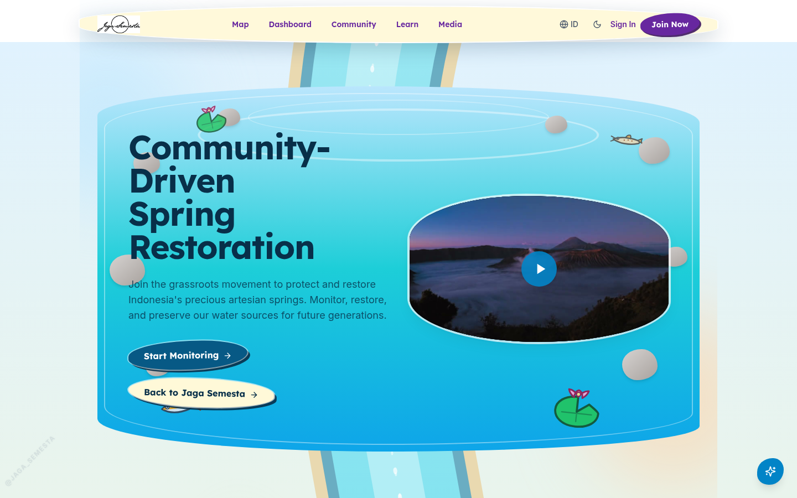
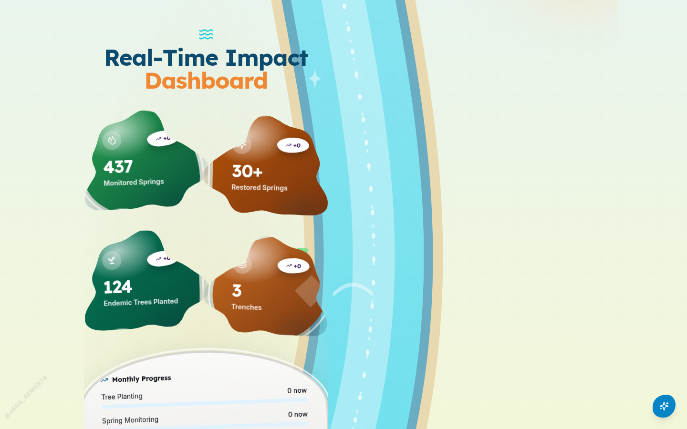
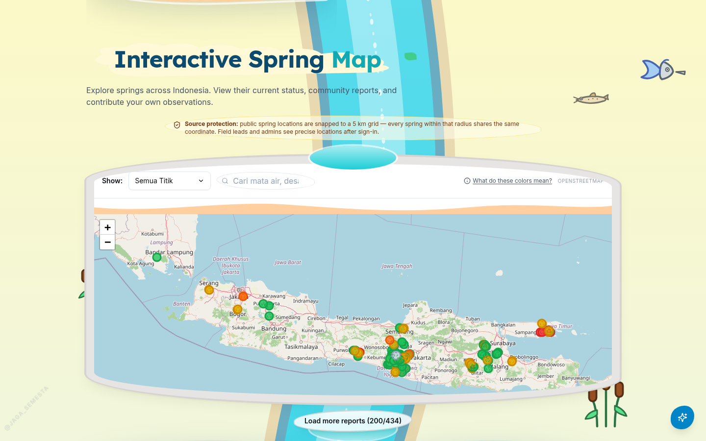
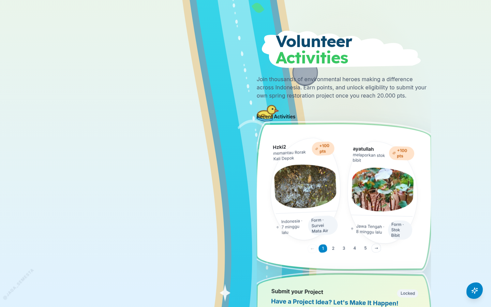
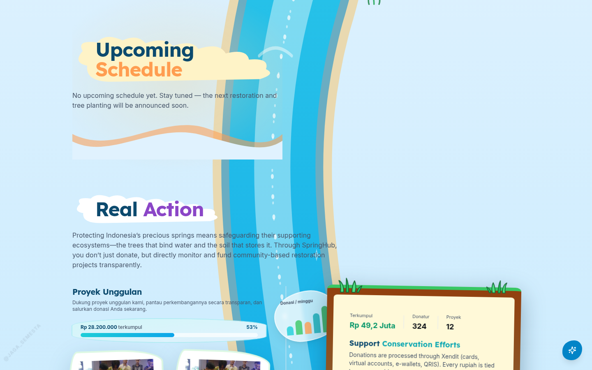
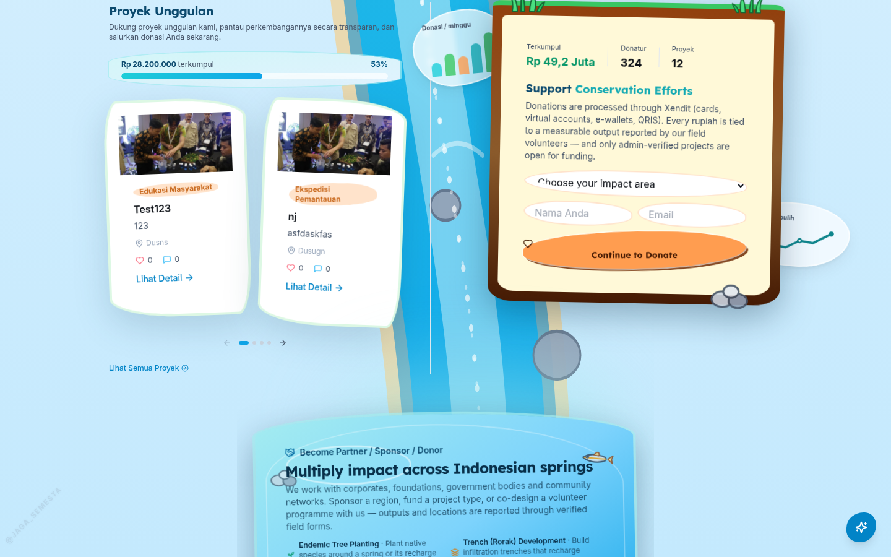
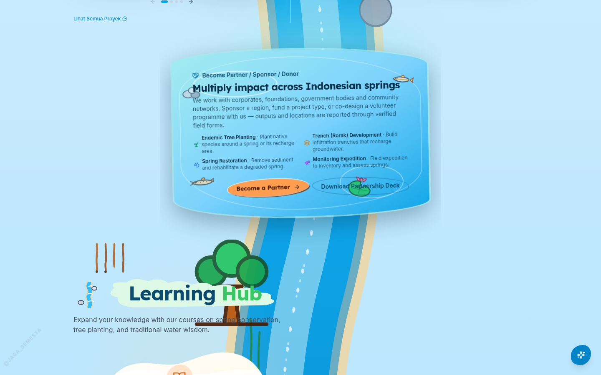
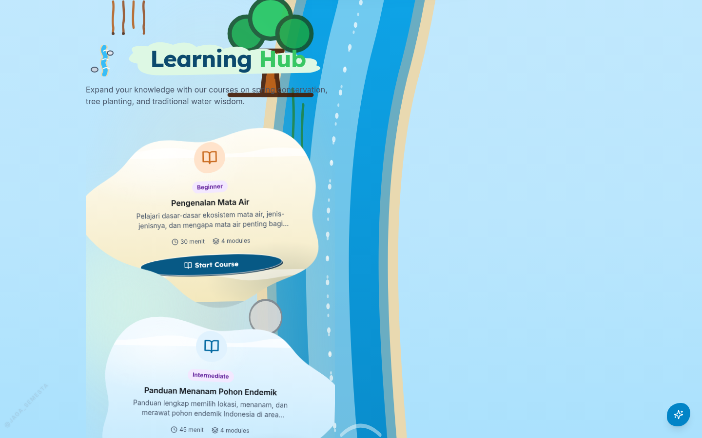
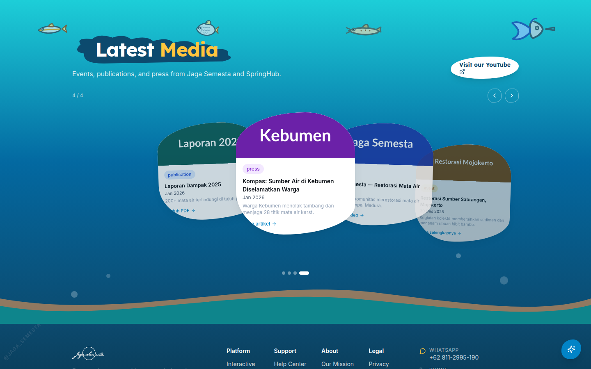
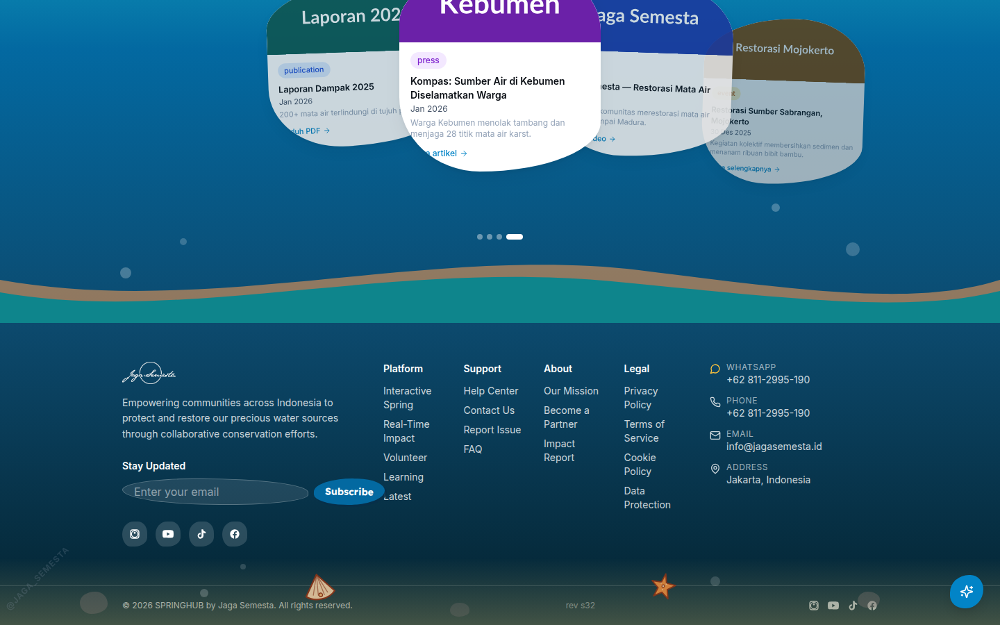

# Laporan Bulan September dan Billing — SpringHub

**Periode:** 1 – 30 September 2026
**Proyek:** SpringHub — Jaga Semesta (www.springhub.id)
**Penyusun:** Ayatullah Reza — Pengembang Website
**Lingkungan kerja:** Staging (`rev s15` → `rev s32`). Produksi **tidak disentuh** (tetap di titik stabil).

---

## Bagian 1 — iPhone, Foto & Carousel

Fokus minggu ini: HP iPhone dan halaman media.

**Yang kita bereskan:**
- **Foto HEIC iPhone bisa diunggah.** Sebelumnya decoder JS diblokir aturan keamanan, sekarang pakai kemampuan bawaan HP + server — aplikasi HEIC yang berat kita buang.
- **Foto tidak "muter terus".** Unggahan offline yang gagal sekarang antre rapi dan coba lagi sendiri, plus gallery admin ada halaman (paging) biar tidak berat.
- **Halaman offline full bahasa Indonesia/Inggris** (~100 kalimat baru) dan file kamera iPhone dirapikan sebelum disimpan.
- **Media jadi carousel bianglala** — kartu melengkung, muter otomatis 5 detik, thumbnail luar diproxy biar tidak 404.
- **Jadwal kegiatan + daftar tanpa kuota** (lengkap dengan pengingat H-1) dan dapur pacu database diperbesar (pool 3→10) agar tidak `503` saat pengunjung ramai.
- **Tes manual 205 → 225** (tambah 20 tes untuk download/event/media).

**Hasil:** iPhone bisa lapor offline penuh, media hidup, tes 225/225 hijau.

---

## Bagian 2 — Dashboard & Gaya BKKCAW

- **Angka "Restored Springs" dikurasi 30+** (tadinya dinamis membingungkan).
- **Gaya visual BKKCAW masuk**: font Lexend, ungu, blob abstrak, ombak, stiker — fondasi rupa-rupa bulan ini.
- **Offline anti-gagal**: spinner tak berujung saat database HP dikunci tab lain + reload otomatis 1x saat file baru belum sampai (form mati).

---

## Bagian 3 — Era Kotak Awan

Semua kontainer landing jadi **awan clip-path** (1 siluet gabungan per kontainer, bukan tumpukan), blob 8 varian, padding lega agar isi tak terpotong, stempel `rev` di footer untuk diagnosis cache. Ikan kartun gantikan anyaman.

---

## Bagian 4 — Tema Sungai Mengalir

Landing dirombak total: **satu sungai mengalir dari kubangan hero sampai laut footer**, kartu-kartu menepi di kiri-kanan.

**Aliran & ornamen:**
- Sungai SVG: tepi pasir, tepi dalam, highlight tengah, **gelembung arus (bukan marka jalan)**, 11 riak organik, 10 batu, tanaman air, 8 kilau berkelip, daun + 2 ikan + **bebek** hanyut.
- Danau peta: sungai masuk (inlet) dan keluar (outlet); tombol *Load more* pindah keluar bingkai agar tak tertutup.
- Ornamen kartun baru: teratai, gelagah, kerikil, akar gantung, rumput, kerang, bintang laut, sungai mini.

**Kartu & section:**
- 4 kartu elemen (tetes–tanah–daun–ikan) → warna brief (hijau–cokelat–hijau tua–oranye), gradasi + double-ring.
- Hero kubangan (video di tengah kolam), peta cincin batu, trio daun, rumpun bambu, lubang rorak donasi (Rp 49,2 Jt + grafik mini), genangan partner, media bawah air, footer dasar laut.
- **Learning Hub full awan puffy**: siluet dari kurva matematis mulus (tanpa sudut tajam), volume cahaya, ivory + kaca biru, riak di dalam kartu, ikon sungai di judul.
- Header kembali isi produksi (Map–Dashboard–Community–Learn–Media, Sign In, Join) dan tidak nempel saat scroll.
- Sekat ombak pemutus aliran dibuang 4 buah.

**Mutu:** tiap ronde diaudit (kontras WCAG, mobile, klik) — 2 ronde sempat GAGAL dan diperbaiki sebelum deploy. `tsc` 0 error, test 50/50.

---

## Galeri — Tangkapan Layar Staging

### 1. Hero — Kubangan

### 2. Dashboard Dampak

### 3. Peta Mata Air (Danau)

### 4. Komunitas

### 5. Jadwal

### 6. Donasi — Lubang Rorak

### 7. Partner — Genangan

### 8. Learning Hub — Awan

### 9. Media — Bawah Air

### 10. Footer — Dasar Laut

---

## Kendala

1. **Kunci Xendit asli** (client) — mesin donasi siap, belum bisa bayar sampai kunci dipasang.
2. **Wildcard DNS staging + R2** — menunggu aksi panel Cloudflare (sama seperti bulan lalu).

---

## Billing

| Item | Detail |
|---|---|
| **Nama** | Ayatullah Reza Chalid |
| **Peran** | Full-stack Developer SpringHub |
| **Periode** | 1 – 30 September 2026 |

### Rincian

| # | Uraian | Jumlah |
|---|---|---|
| 1 | Gaji | Rp3.500.000 |
| 2 | Ikan | Rp100.000 |
| 3 | Bensin | Rp50.000 |
| | **Subtotal rincian** | **Rp3.650.000** |
| | **Total tercantum** | **Rp3.750.000** |

> ⚠️ **Catatan:** total rincian (Rp3.650.000) selisih **Rp100.000** dari total tercantum (Rp3.750.000). Mohon konfirmasi item tambahannya sebelum pembayaran.

### Bank Tujuan Pembayaran

| | |
|---|---|
| **Penerima** | Ayatullah Reza Chalid |
| **Bank** | BANK BRI |
| **Nomor Rekening** | 359001035332531 |

---

> **Terima kasih atas kerjasamanya.**
> SpringHub — Jaga Semesta — www.springhub.id
